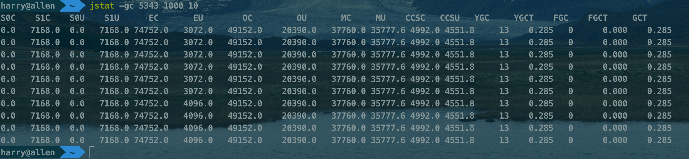
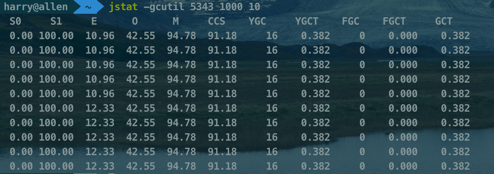

启动程序

执行jstat -gc 5343 1000 10

分析：

S0C：survive 0区内存大小为0

S1C：survive 1区内存大小为7168kb

S0U：survive 0区内存使用量为0

S1U：survive 1区内存使用量为7168kb

EC：Eden区的内存大小为74752kb

EU：Eden区的使用量为3072kb

OC：老年代的容量为49152kb

OU：老年代的使用量为20390kb

MC：metaspace的容量为37760kb

MU：metaspace的使用量为35777kb

CCSC：压缩类空间大小为4992kb

CCSU：压缩类空间的使用量为4551.8kb

YGC：young GC次数为13次

TGCT：young GC总共消耗0.285秒

FGC：full GC次数为0

GGCT：full GC总共花费0秒

GCT：垃圾回收总共花费0.285秒

执行jstat -gcutil 5343 1000 10

survive 1区使用100%

Eden区使用42.55%

metaspace区使用94.78%

压缩类空间使用91.18%

young GC16次

young GC总共消耗0.382秒

full GC 0次

总的GC时间时0.382秒

