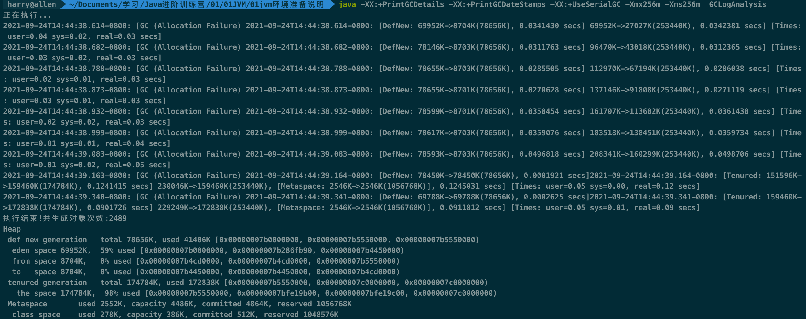
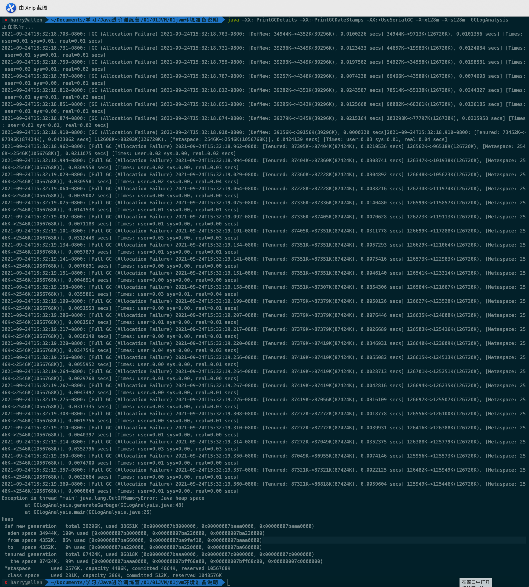
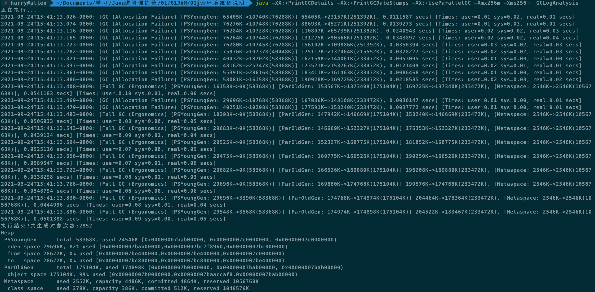
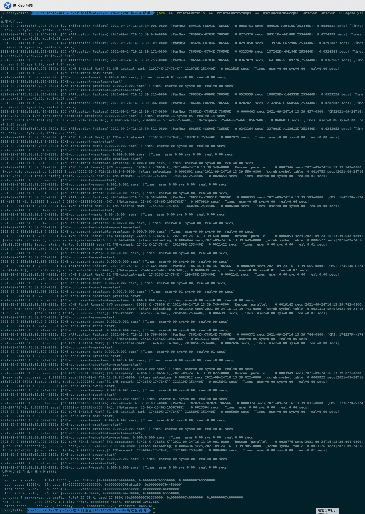
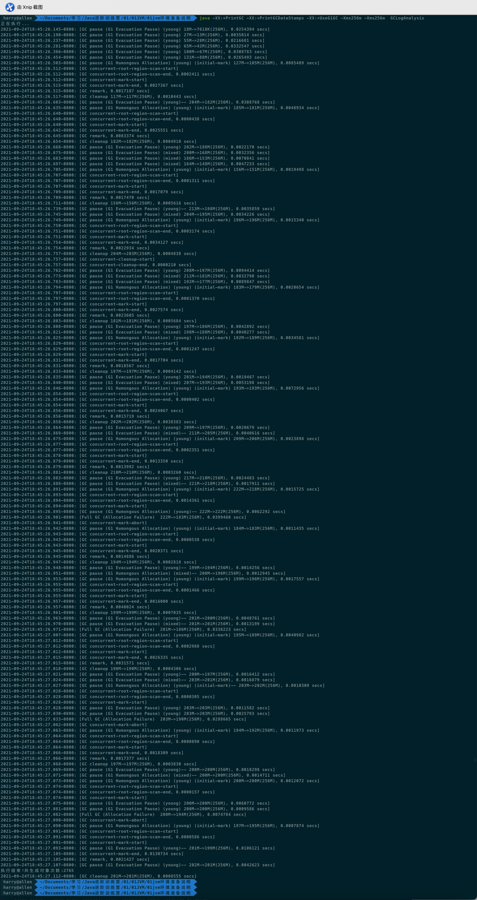

**一.（选做）**使用 GCLogAnalysis.java 自己演练一遍串行 / 并行 /CMS/G1 的案例。

##### 机器情况：

​	处理器：2.7 GHz 双核Intel Core i5

​	内存：8 GB 1867 MHz DDR3

1. ##### 串行GC

   ###### 1.1 配置256m的堆内存

   java -XX:+PrintGCDetails -XX:+PrintGCDateStamps -XX:+UseSerialGC -Xmx256m -Xms256m  GCLogAnalysis

   

   分析：

   - 前面发生7次年轻代的垃圾回收，后面发生两次老年代的垃圾回收。

   - 7次年轻代的垃圾回收总耗时0.2423674秒，平均暂停时间0.03462秒。

   - 2次老年代的垃圾回收总耗时0.2143141秒，平均暂停时间0.10716秒。

   - 垃圾回收总耗时0.4566815秒。

   - 第七次young gc后，老年代的内存使用了160299K-8703K=151596k（148m），老年代分配的总的内存是174784K（170m），老年代的内存使用率超过了87%，所以导致了老年代的gc。

   - 程序运行结束时，年轻代的eden区内存使用率59%，老年代内存使用率98%。

   ###### 1.2 配置128m的堆内存

   java -XX:+PrintGCDetails -XX:+PrintGCDateStamps -XX:+UseSerialGC -Xmx128m -Xms128m  GCLogAnalysis

   

   分析：发生7次young gc后，发生了1次old gc，之后发生了25次full gc，最终出现了堆内存溢出。发生内存溢出的原因是老年代内存不足以存放程序产生的对象。

2. ##### 并行GC

   ###### 2.1 配置256m的堆内存

   java -XX:+PrintGCDetails -XX:+PrintGCDateStamps -XX:+UseParallelGC -Xmx256m -Xms256m  GCLogAnalysis

   

   分析：

   - 发生10次young gc，然后发生一次full gc，然后又发生两次young gc，最后发生8次full gc。

   - young gc总耗时0.1694326秒，平均暂停时间0.01412秒。

   - full gc总耗时0.3932095秒，平均暂停时间0.0436899秒。

   - 垃圾回收总耗时0.5626421秒。

   - 相比SerialGC，ParallelGC的单次gc暂停时间更短。

3. ##### CMS

   java -XX:+PrintGCDetails -XX:+PrintGCDateStamps -XX:+UseConcMarkSweepGC -Xmx256m -Xms256m  GCLogAnalysis

   

   分析：

   - young 区使用ParNew算法回收，old区使用CMS算法回收。

   - CMS回收的流程：CMS Initial Mark初始标记、CMS-concurrent-mark并发标记、CMS-concurrent-preclean并发预清理、CMS-concurrent-abortable-preclean可取消的并发预清理、CMS Final Remark最终标记、并发清理，并发重置。

   - 其中初始标记和最终标记都是需要STW的，其他的阶段是并发执行的。
   - 第一次CMS回收时，老年代的内存使用率是63%（110274k/174784k），并未达到92%的阈值，主要原因是上一次young gc晋升到老年代的对象大小为107m（118977k-8703k），超出了老年代的剩余内存空间。

   

4. ##### G1

   java -XX:+PrintGC -XX:+PrintGCDateStamps -XX:+UseG1GC -Xmx256m -Xms256m  GCLogAnalysis

   

   分析：

   - G1是基于Region的堆内存布局和面向局部收集的设计思路。

   - G1是一款可预测停顿时间的垃圾收集器，MixedGC模式的回收标准是哪个Region中存放的垃圾数量最多，回收收益最大，就会优先收集那个区域，收集目标范围不再是整个新生代或者整个老年代再或者整个堆内存。

   - G1的新生代和老年代不再是固定的，而是一个动态的集合。

   - G1有专门用来存放大对象的Humongous区域。

   

   - G1的回收步骤：
     - initial-mark初始标记（标记GC Roots能关联到的对象）
     - concurrent-mark并发标记
     - remark最终标记（SATB处理在并发阶段业务线程导致的引用变动的对象）
     - cleanup筛选回收。