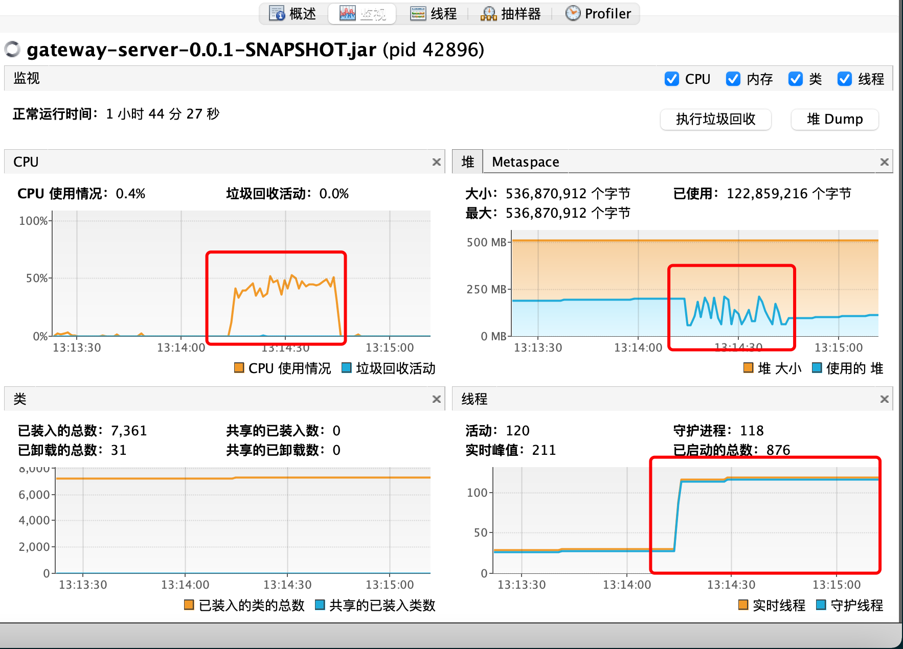
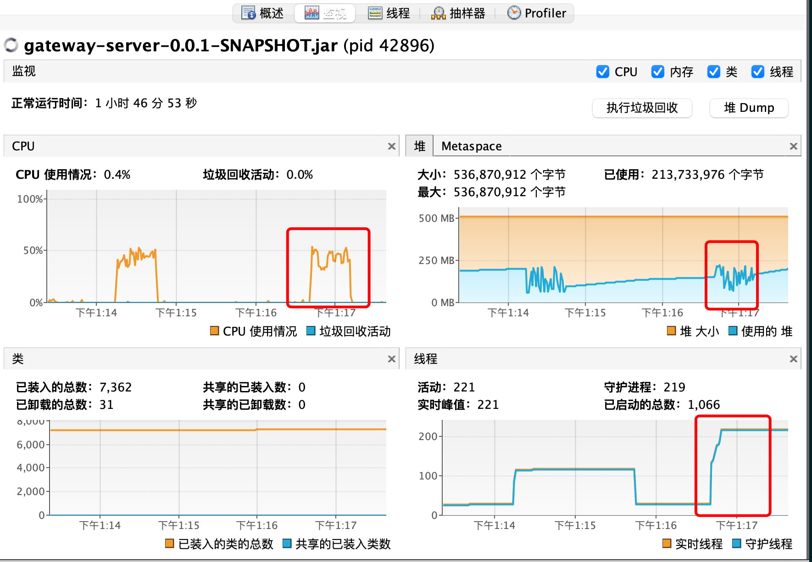

**二.（选做）**使用压测工具（wrk 或 sb），演练 gateway-server-0.0.1-SNAPSHOT.jar 示例。


1. 启动gateway-server：java -jar -Xmx512m -Xms512m -XX:+PrintGCDetails gateway-server-0.0.1-SNAPSHOT.jar

2. 使用wrk对程序进行压测：wrk -t8  -c100 -d30s http://localhost:8088/api/hello，模拟在30秒内，8个线程下100个并发，期间程序发生63次Young GC。

   ```
   Running 30s test @ http://localhost:8088/api/hello
     8 threads and 100 connections
     Thread Stats        Avg（平均值）Stdev（标准差）Max（最大值）+/- Stdev（正负一个标准差所占比例）
       Latency（延迟）      15.09ms     25.59ms     251.63ms             88.56%
       Req/Sec（每秒请求数）  1.89k       0.86k       7.83k               74.98%
     445531 requests in 30.08s, 53.19MB read（445531个请求，数据流量53.19MB）
   Requests/sec:  14813.53（QPS）
   Transfer/sec:      1.77MB（平均每秒流量）
   ```

   

3. 测试200并发：wrk -t8  -c200 -d30s http://localhost:8088/api/hello，期间程序发生71次Young GC。

   ```
   Running 30s test @ http://localhost:8088/api/hello
     8 threads and 200 connections
     Thread Stats   Avg      Stdev     Max   +/- Stdev
       Latency    23.91ms   34.04ms 262.72ms   86.86%
       Req/Sec     1.93k   820.79     5.94k    73.48%
     452537 requests in 30.08s, 54.03MB read
     Socket errors: connect 0, read 6, write 0, timeout 0
   Requests/sec:  15045.31
   Transfer/sec:      1.80MB 
   ```

   

4. 

